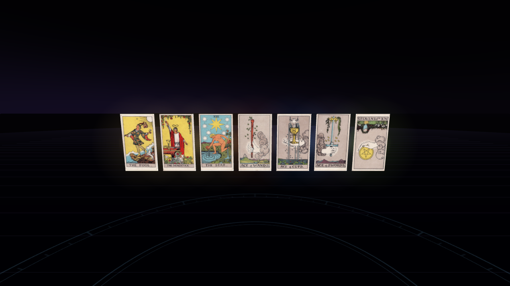
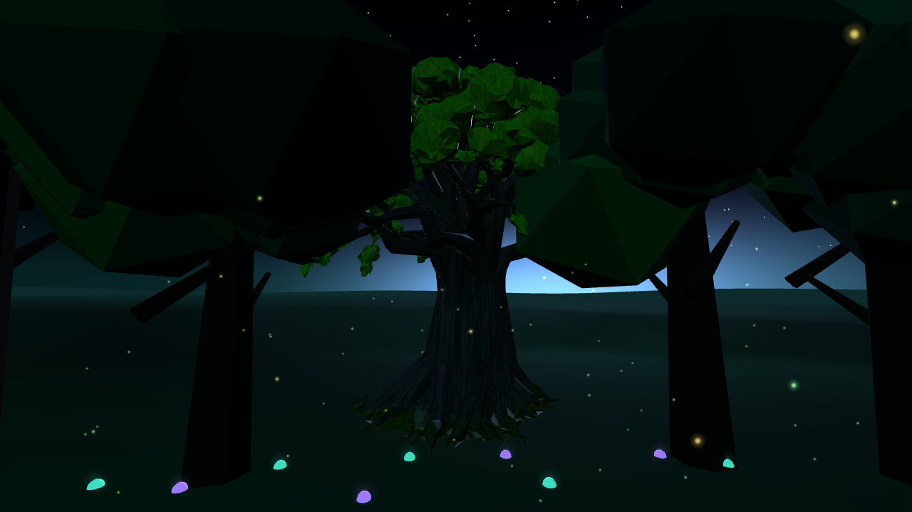

# Illustrated tarot and Grove hero oak

## Tarot

All 78 Rider–Waite–Smith faces now have historic illustrations by Pamela Colman Smith. Every downloaded file in the [Commons TaionWC collection](https://commons.wikimedia.org/wiki/Category:Rider-Waite-Smith_tarot_deck_(TaionWC)) had **Public domain** / **Copyrighted: False** metadata. No modern commercial deck artwork is included. Each file's source page, download rendition, source hash, shipped hash and complete license metadata are retained in `assets/tarot/provenance.json`.

Images are fitted without cropping to 512×884 WebP canvases. Some scans were fetched as Commons-supported 500px renditions after the original endpoint rate-limited an individual file. The receipt identifies the exact retrieved rendition. These are bundled local assets: runtime does not depend on Commons. Textures load only for drawn cards, use sRGB and bounded anisotropy, and are disposed with each card. Missing images retain the procedural face. Existing names, meanings, reversals, randomness, journal and session formats remain unchanged.

## Grove oak

One Meshy 6 tree was generated with the user's explicit **30-credit ceiling**: geometry 20 + PBR texturing 10. Both tasks succeeded; no further paid jobs ran. Exact task IDs, prompts, generation settings, source hash and provider rights reference are in `assets/models/grove-oak/provenance.json`. The original GLB is shipped unchanged. This generated tree is not public-domain artwork; Meshy's account-dependent ownership/use terms apply, and Meshy attribution is retained.

The tree has **20,489 triangles, one mesh/material, four 2048×2048 images and 10,535,204 bytes**. Static validation independently decoded the images, checked the GLB v2 structure and embedded buffer bounds, and enforced a 25K-triangle/12MB/2K-texture/six-material policy. Node tests verify shipped hashes. The Game Development Studio `game-dev` executable was unavailable on this host; these are project validation receipts and browser checks, rather than a CLI-generated canonical package or vendor-admission receipt. No Blender normalization was needed or performed.

The loader fits the oak to 12m high (12m maximum width), grounds it, and places it at bearing 185°, radius 18.5m. The complete XZ bounding rectangle remains over 13m from the centre. The procedural tree in that slot remains during loading and becomes hidden only on success; it retains shared-material ownership until normal world teardown. Loading failure leaves the procedural Grove intact. Simplified mode skips the GLB entirely. Low intensity/reduced motion use the static model without motion or new emissive effects. Bark is nonmetallic and nonemissive, and no shadows are added. Static moon-bounce/hemisphere lighting helps expose bark detail.

Imported resources belong to each world instance. Teardown releases geometry/material/textures and explicitly closes ImageBitmaps. A late GLB completion is discarded and disposed if its holder is detached. The tree is deliberately a single asset trial: remaining Grove trees retain procedural forms, and the generated canopy is still stylized rather than a complete photorealistic forest.

## Verification and limits

Browser coverage loads and decodes every card face, checks reversed orientation, renders sample cards, cycles illustrated-card GPU cleanup, loads/renders the oak, checks clearing bounds, cycles world teardown, checks the simplified fallback, and verifies leaving during a delayed load. The existing ritual/session/audio/accessibility suite also runs.

Physical Quest testing remains required: download latency for the 10.5MB GLB, decoded texture memory (four 2K maps), sustained frame rate/thermal behaviour, canopy silhouette at stereo resolution, and desktop/VR/MR transitions. Software-rendered desktop counters are lifecycle diagnostics, not Quest performance measurements. Lower-resolution textures or a separate LOD are optional follow-ups; no extra paid optimization was requested.

