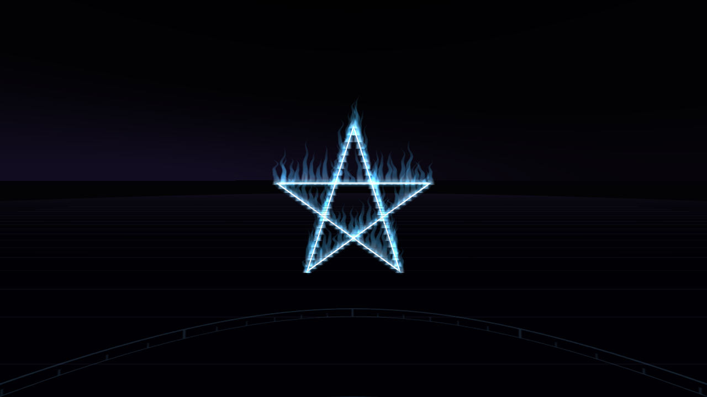
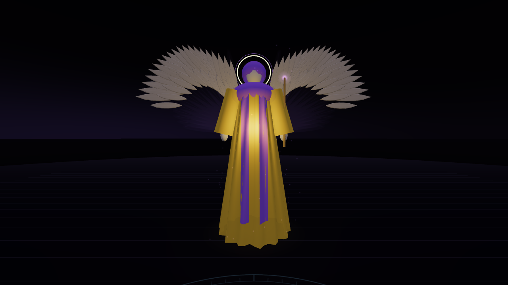

# Ritual artwork pass: LBRP

This pass establishes the first visual treatment for ritual geometry and guardians. It continues on `modernization/three-r186`; ritual JSON, step order, bearings, controller bindings and journal storage are unchanged.

## Pentagrams and luminous lines

- Pentagrams have a finer readable core and procedurally animated blue flame tongues. A single indexed ribbon mesh per star replaces the old drifting glow points; shader noise shapes and curls the flames without per-frame position-buffer updates.
- Flame reveal follows the existing tracing order and progress, including banishing/invoking paths. Near-eye fading reduces flames close to the viewer.
- Shared trace halos and cross beams fade toward their silhouette rather than looking like an equally bright outer tube. Separate core and halo draw ranges respect their different radial subdivisions.
- Low intensity, simplified mode and reduced-motion preference suppress the new flame layer, preserving a steady traced star. Guardian wing/body/particle drift also stops in those modes. Existing quiet-mode behavior for other ritual actions remains in place.

## Guardians

The former transparent robe and wing planes are replaced by a recognizable ceremonial angel silhouette: folded cloth geometry, fitted colored trim, hooded head, relaxed sleeves and hands, layered feather wings, fine concentric halos and wand/sword/cup/sheaf/orb attributes. The four LBRP palettes and their ritual attributes continue to come from their existing JSON.

Feathers are instanced: 32 per wing in full mode, 12 in simplified mode. Feather barbs and fabric weave are generated with local canvas textures. Group disposal owns these detail textures and instance buffers; the existing shared wing texture remains application-owned. There are no downloaded models, image-generation jobs, added network asset requests, bloom targets or extra guardian lights.

The intended style is sculptural and ceremonial, not photorealistic. These models still need physical Quest review for silhouette/depth, stereo transparency, readability, light intensity and frame time. This pass does not yet replace trees, planet artwork or add locations.

## Verification

`npm test`, `npm run build`, and the complete browser smoke suite verify ritual loading, replay/resume, world/resource cycles and the new detail. The additional visual test checks trace/halo half-reveal ranges, quiet-mode flame suppression, feather instancing and repeated guardian/star cleanup. Close-ups are rendered in Practice Room to isolate the artwork.

Raw repeated-cleanup counters: [visual-resource-counters.json](captures/visual-resource-counters.json).
