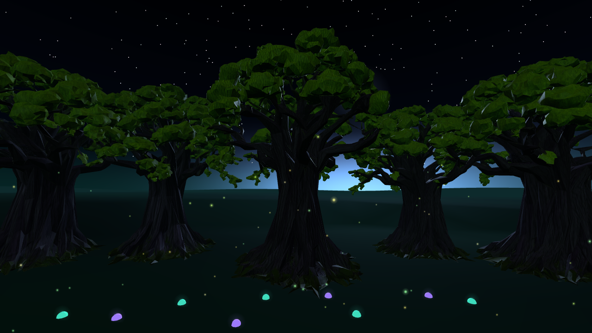
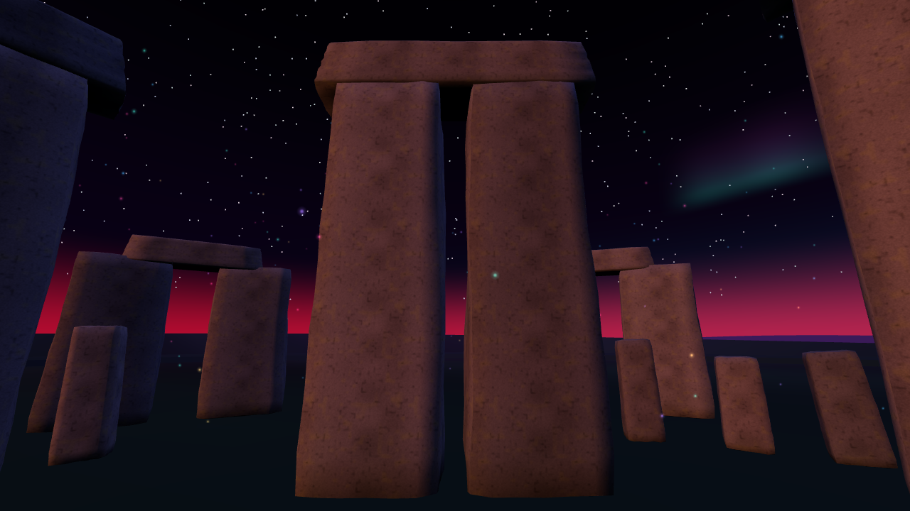
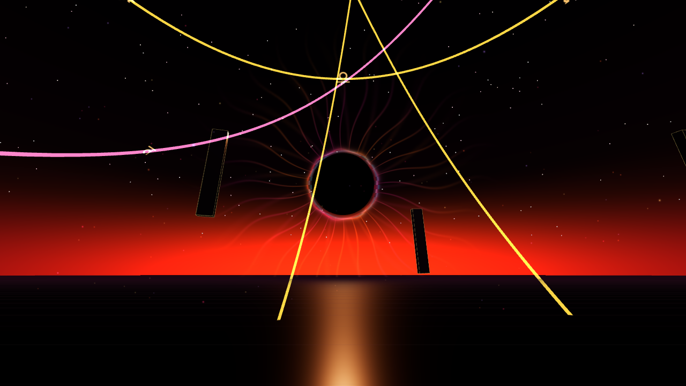

# Verification results

Review date: October 9, 2026. Baseline: main commit `4b2e5c1feb6d8ec1115d976bf4fdfef880fed3fe`.

The subsequent [LBRP artwork pass](ritual-artwork.md) adds a sixth browser test for flame reveal, quiet fallbacks, feather instancing and resource cleanup, with close-up captures. The table below records the initial modernization verification.

The audio exit repair adds a seventh browser regression using real Web Audio contexts. Leaving or finishing closes the complete synth graph, including looping drone/LFO sources and reverb tails, and cancels narration. Selection, journal, settings and after-rite screens cannot initialize menu audio. Beginning or resuming starts a fresh context; muted rites do not create one. The test checks context closure during sustained notes, menu/settings silence and fresh audio after resume and a new begin. Headset listening remains part of physical acceptance.

| Check | Result |
| --- | --- |
| `npm install` / locked dependencies | Three 0.186.0, Vite 8.3.4, Playwright 1.64.0; zero reported vulnerabilities |
| `npm test` | 2 tests passed: all 4 published rituals, malformed/reference/budget validation |
| `npm run build` | Passed; expected warning for the Three entry chunk (740.74 kB / 188.57 kB gzip) |
| `npm run test:smoke` | 5 tests passed against production `/virtual-rites/` in Chromium / SwiftShader |
| Desktop flow | Library selection, begin, next, repeat, first-person/witness, conductor, save/leave, reload/resume passed |
| World / effect coverage | 5 worlds in full and simplified modes; every expanded step of all 4 rituals rendered and repeated |
| Resource ownership | Mesh root cleanup, child parent detachment, deduplicated geometry, card-front disposal, shared tarot back and guardian-wing survival passed |
| Persistence | Existing `vr.*` settings and journal survived reload; progress saved/resumed |
| Failure paths | WebGL2 startup failure notice and exclusion of a malformed ritual passed |
| Physical Quest / hardware GPU / Firefox / Safari | Not performed; acceptance checklist in audit |

After warming the effect caches, six Grove/Room world-reset cycles returned to **5 geometries / 5 textures** in Practice Room. Some cached shader programs are released after further renders (8 programs at warm sample, 4 at final sample). Shared glow, tarot back and guardian wing caches are deliberately retained for the application's lifetime. These counters are not GPU byte measurements.

## Grove prototype (initial migration, before hero asset)

Measurements in one production desktop frame with the same full-mode Grove camera:

| Counter | Existing Grove | Opt-in prototype |
| --- | ---: | ---: |
| Draw calls | 349 | 189 |
| Tracked geometries | 242 | 190 |
| Tracked textures | 3 | 3 |
| Triangles | 63,002 | 56,954 |

The draw-call reduction is approximately 46%; it is not a claimed frame-rate improvement. Four forced prototype rebuilds stayed at **190 geometries / 3 textures**. The minimum new fungus radius was **12.55 m**. Low/simplified build produced **12 caps and 0 point lights**. Two local lights are used only in full animated prototype mode; no shadows or bloom pass are added.

Raw diagnostics: [world/reset counters](captures/resource-counters.json), [Grove counters](captures/grove-counters.json).

## Captures

Captured from the migrated production build. These are review captures, not r128/r186 pixel comparisons. The Grove capture hides the home overlay to show the environment; the desktop capture includes the existing ritual HUD.

No physical VR or mixed-reality screenshots are available. Refer to [the audit](modernization-audit.md) for lighting/color compatibility risks, retained tarot redraw semantics, and optional WebGPU/TSL work.

## Illustrated assets follow-up

All 78 public-domain card faces decode at 512×884, and samples render upright/reversed. The Meshy oak passes static GLB policy checks (20,489 triangles, one material, four 2K embedded images, 10.5MB). Its bounding rectangle stays more than 13m from the ritual centre; simplified mode skips the GLB. Repeated card/world teardown returns to warm GPU geometry/texture counts, and delayed/missing assets have disposal/fallback coverage.

The final local checks are **4 Node tests, production build, and 11 Playwright browser tests**. Browser coverage retains all previous ritual replay, session/journal, accessibility, WebGL failure, visual-effect and audio-exit checks. Current receipts and screenshots: [asset details](illustrated-assets.md), [GPU counters](captures/asset-resources.json). The initial Grove comparison above is historical and does not describe the added tree's cost. Physical Quest performance and VR/MR transitions remain unverified.

## Narration, ritual media and instanced Grove follow-up

The production build and seven Node tests pass. A full 15-test desktop Chromium run passed, including actual Kokoro WASM preparation and nonzero speech PCM, decoding all 98 recorded clips, missing native voices, narration cancellation, media image lifetime, quiet video posters, ritual replay/resume, audio exit and world disposal. A subsequent four-test targeted run passed for the final media lifecycle and local worker retry fixes. There are now 16 browser tests; real model downloading is opt-in via `VR_LOCAL_VOICE=1`, and regular CI skips that network-heavy test.

98 separate Daniel narration clips cover static phrases in all four existing rites. They cost 3,781 credits against the approved 4,200-credit ceiling; the selected pronunciation pilot cost a separate 516 credits. One personalized placeholder phrase uses native/local speech. No sound effects were generated. See [media authoring and narration](ritual-media.md) for paths, actions, settings and asset provenance.

The Grove now uses 18 rotated/scaled instances of one imported oak. Measured clearing clearance is 13.075m. The captured scene renders 422,914 triangles in 10 draws, with 10 geometries and seven textures. Three world teardown cycles return to the warm baseline of five geometries and three textures; simplified mode retains procedural trees. These desktop counters establish ownership and draw batching, not Quest performance. [GPU receipt](captures/instanced-oak-resources.json).

Physical Quest checks remain: audio unlock after gesture/XR entry, recorded and local narration in both browsers, local voice memory/latency, headset suspension, video codecs, frame time with all oaks, and MR transitions. The local speech dependency tree has six moderate npm audit findings, documented in the media guide.

## Explicit narration source preference

Comfort and access now persists Automatic, Recorded audio only, Browser TTS only, or Local voice only. Explicit modes do not fall through to a different provider. Ritual-authored narration overrides the shared clip library in Recorded/Automatic modes. Changing source cancels current speech; selecting Local enables and prepares its voice. Build and seven Node tests passed, along with four media regression tests and the new settings/source-selection test (17 browser tests total, including the opt-in real-model test).

## Stonehenge surface pass

The existing 84 stones retain their positions, heights, ring gaps and sunrise alignment. Worn beveled edges and shallow irregular geometry replace hard, faceted boxes. Shared deterministic mineral-grain color and bump maps add pitting and lichen, with subtle vertex-color ground staining. No external texture downloads, paid generations, new lights or shadow passes were added.

Production build and the targeted Stonehenge browser test pass (18 browser tests total). The stones contain 60,480 triangles in full mode. The captured view renders 66,602 scene triangles in 31 draws. Only two 512-square texture maps are shared across stone materials; simplified mode uses a 128-square color map, lower geometry detail and no bump map. Three teardown cycles return to the warm baseline of four geometries and three textures. Physical Quest frame time remains unverified. [Resource receipt](captures/stonehenge-resources.json).

## Temple of the Black Sun visual pass

The original monolith geometry, materials and movement remain unchanged. A single analytic GLSL corona replaces 28 rectangular ray planes and three halo sprites: bent tapering rays, spectral wisps and a bounded red/cyan edge split move slowly, without flashing the scene. Low intensity, reduced motion and simplified mode use a dimmer static corona and stationary symbol orbits; Soft reduces corona brightness.

Four orbit families now carry zodiac, planetary, alchemical and original angelic-inspired marks. The last family is decorative and is not presented as a historical angelic alphabet. Four small shared canvas atlases avoid per-symbol texture loading; full mode has 32 symbols and simplified mode has 16. Procedural alchemical and angelic marks avoid dependence on specialist fonts; zodiac/planetary glyph appearance follows the platform's symbol fonts.

Production build and the targeted browser test pass, checking shader rendering, all four families, quiet/reduced-motion behavior and three teardown cycles returning to warm geometry/texture counts. There are now 19 browser tests. Physical Quest appearance/frame time remain unverified. No paid asset generation was used.

