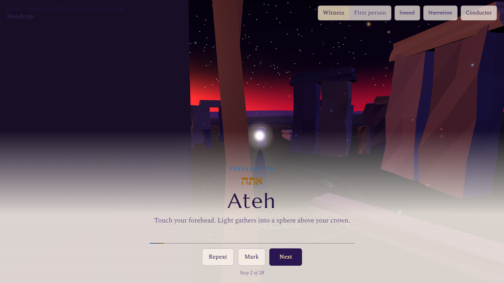
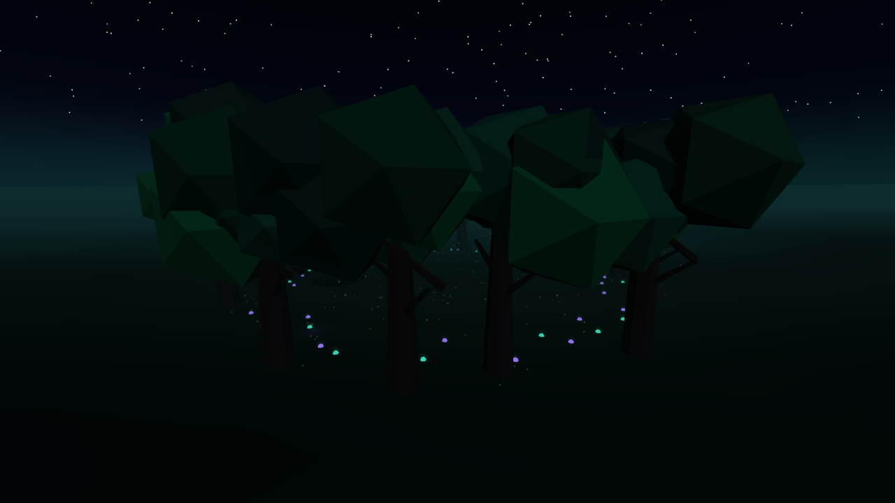

# Verification results

Review date: October 9, 2026. Baseline: main commit `4b2e5c1feb6d8ec1115d976bf4fdfef880fed3fe`.

| Check | Result |
| --- | --- |
| `npm install` / locked dependencies | Three 0.186.0, Vite 8.3.4, Playwright 1.64.0; zero reported vulnerabilities |
| `npm test` | 2 tests passed: all 4 published rituals, malformed/reference/budget validation |
| `npm run build` | Passed; expected warning for the Three entry chunk (740.74 kB / 188.57 kB gzip) |
| `npm run test:smoke` | 5 tests passed against production `/virtual-rites/` in Chromium / SwiftShader |
| Desktop flow | Library selection, begin, next, repeat, first-person/witness, conductor, save/leave, reload/resume passed |
| World / effect coverage | 5 worlds in full and simplified modes; every expanded step of all 4 rituals rendered and repeated |
| Resource ownership | Mesh root cleanup, child parent detachment, deduplicated geometry, card-front disposal, shared tarot back and guardian-wing survival passed |
| Persistence | Existing `vr.*` settings and journal survived reload; progress saved/resumed |
| Failure paths | WebGL2 startup failure notice and exclusion of a malformed ritual passed |
| Physical Quest / hardware GPU / Firefox / Safari | Not performed; acceptance checklist in audit |

After warming the effect caches, six Grove/Room world-reset cycles returned to **5 geometries / 5 textures** in Practice Room. Some cached shader programs are released after further renders (8 programs at warm sample, 4 at final sample). Shared glow, tarot back and guardian wing caches are deliberately retained for the application's lifetime. These counters are not GPU byte measurements.

## Grove prototype

Measurements in one production desktop frame with the same full-mode Grove camera:

| Counter | Existing Grove | Opt-in prototype |
| --- | ---: | ---: |
| Draw calls | 349 | 189 |
| Tracked geometries | 242 | 190 |
| Tracked textures | 3 | 3 |
| Triangles | 63,002 | 56,954 |

The draw-call reduction is approximately 46%; it is not a claimed frame-rate improvement. Four forced prototype rebuilds stayed at **190 geometries / 3 textures**. The minimum new fungus radius was **12.55 m**. Low/simplified build produced **12 caps and 0 point lights**. Two local lights are used only in full animated prototype mode; no shadows or bloom pass are added.

Raw diagnostics: [world/reset counters](captures/resource-counters.json), [Grove counters](captures/grove-counters.json).

## Captures

Captured from the migrated production build. These are review captures, not r128/r186 pixel comparisons. The Grove capture hides the home overlay to show the environment; the desktop capture includes the existing ritual HUD.

No physical VR or mixed-reality screenshots are available. Refer to [the audit](modernization-audit.md) for lighting/color compatibility risks, retained tarot redraw semantics, and optional WebGPU/TSL work.
